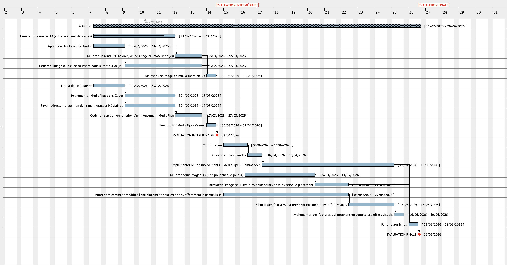

## Diagramme / Planning global

## Répartition des tâches pour l'évaluation intermédiaire

- **V0**: premiers exemples pour tester et expérimenter, sans structure bien définie
- **V1**: code fonctionnel, structuré mais indépendant des autres tâches
- **V2**: code fonctionnel intégré à l'ensemble

| Tâche                         | Responsables  | V0 (prévu) | V0 (réalisé) | V1 (prévu) | V1 (réalisé) | V2 (prévu) | V2 (réalisé) |
| ----------------------------  | ------------- | ----       | ----         | ----       | ----         | ---        | ---          |
| Création des personnages      |               | .....      | .....        | .....      | .....        | .....      | .....        |
| Création du terrain de jeu    | Van-Kévin     | 13/03      | .....        | .....      | .....        | .....      | .....        |
| Rendu des images              |               | .....      | .....        | .....      | .....        | .....      | .....        |
| Détection des mouvements      | Birame        | 13/03      | .....        | .....      | .....        | .....      | .....        |

## Compte-rendu des séances

### Séance 1 - 11/02

**Objectifs pour la séance 2 :**

> Regarder des tutoriels pour comprendre Godot

> Planning et répartition des tâches

***Pour l'évaluation intermédiaire :*** 

Il faudrait avoir une démo qui teste déjà MediaPipe, la corrélation, le stéréo et le jeu (ex : Un jeu où on a un cube qui tourne si on baisse la main et qui tourne si on le lève). L'idée est d'avoir une base solide qu'on peut réutiliser pour la suite (c'est censé représenter un tiers de la charge de travail totale). Ce n'est pas grave de ne pas avoir de jeu final (on peut toujours avoir une petite liste de candidats). Il faut s'assurer que chaque bloc est opérationnel.

**Proposition de test pour l'évaluation intermédiaire :** Réaliser un jeu minimaliste dans lequel on contrôle la rotation d'un cube. Lever la main stopperait le cube et la baisser le ferait tourner.

***Remarques de J. Lefeuvre :***
- Faire le versionning dans Git (pas de copie V2, V3, V4, etc...)
- Pour les fihiers tests, les mettre dans un dossier `src` et les documenter de telle sorte que les autres puissent les utiliser.

### Séance 2 - 20/02

### Séance 3 - 23/02 (Encadrant absent)

### Séance 4 - 13/03

### Séance 5 - 16/03

### Séance 6 - 27/03

### Séance 7 - 03/04

### Séance 8 - 10/04

### Séance 9 - 15/04

### Séance 10 - 21/04

### Séance 11 - 05/05

### Séance 12 - 13/05

### Séance 13 - 27/05

### Séance 14 - 10/06

### Séance 15 - 15/06 

### Séance 16-20 - Semaine du 22/06