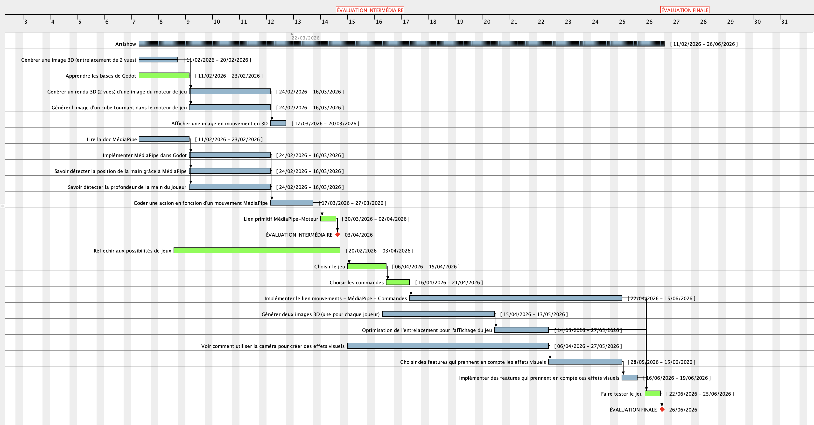

## Diagramme / Planning global

Légende : 
- En vert : tâches de groupe
- En bleu : tâches attribuées à une partie du groupe
- En rouge : jalons

## Répartition des tâches pour l'évaluation intermédiaire

- **V0**: premiers exemples pour tester et expérimenter, sans structure bien définie
- **V1**: code fonctionnel, structuré mais indépendant des autres tâches
- **V2**: code fonctionnel intégré à l'ensemble

| Tâche                         | Responsables  | V0 (prévu) | V0 (réalisé) | V1 (prévu) | V1 (réalisé) | V2 (prévu) | V2 (réalisé) |
| ----------------------------  | ------------- | ----       | ----         | ----       | ----         | ---        | ---          |
| Création du terrain de jeu (cube, mouvement, caméra)   | Van-Kévin     | 13/03      | .....        | .....      | .....        | .....      | .....        |
| Rendu des images              | Adam et Hélias              | .....      | .....        | .....      | .....        | .....      | .....        |
| Détection des mouvements      | Birame et Hugo       | 13/03      | .....        | .....      | .....        | .....      | .....        |

| Tâche (détaillée)             |Description |Responsables  |Date de début (effective) | Date de fin (effective) |
| ----------------------------  | ------------- | ----       | ----         | ----       |
| Générer une image 3D (entrelacement de 2 vues) | Écrire un programme Python pour entrelacer plusieurs vues et l'afficher | Van-Kévin | 11/02/26 | 11/02/26 |
|Apprendre les bases de Godot | Lire la doc, regarder des tutos pour se familiariser avec l'environnement de développement | Groupe | 11/02/26 | ... |
|Générer un rendu 3D (2 vues) d'une image du moteur de jeu | Générer et afficher une image 3D depuis Godot | Adam, Hélias | 27/02 | 13/03 (merci VK) |
|Générer l'image d'un cube tournant dans le moteur de jeu | Créer une scène dans Godot avec un cube tournant | Van-Kévin | 19/02 | 20/02 |
|Afficher une image en mouvement en 3D | Génerer plusieurs images et les afficher pour rendre le mouvement sans stocker d'images intermédiaire dans l'espace mémoire | Adam, Hélias | 27/02 | 13/03 |
|Lire la doc MédiaPipe | ... | Hugo et Birame | ... | ... |
|Implémenter MédiaPipe dans Godot | ... | Hugo et Birame | ... | ... |
|Savoir détecter la position de la main grâce à MédiaPipe | ... | Hugo et Birame | ... | ... |
|Savoir détecter la profondeur de la main du joueur | ... | Hugo et Birame | ... | ... |
|Coder une action en fonction d'un mouvement MédiaPipe | ... | Hugo et Birame | ... | ... |
|Lien primitif MédiaPipe-Moteur | Afficher un cube tournant qui s'arrête de tourner quand l'utilisateur exécute un mouvement particulier (ouvrir ou lever la main) | Groupe | ... | ... | 
| Réfléchir aux possibilités de jeux| Noter dans un fichier toutes les idées de jeux, chercher en ligne des templates open-source (la piste des jeux VR est à explorer) | Groupe |  ... |  ... | 
|Choisir le jeu | ... | Groupe | ... | ... |
|Choisir les commandes | ... | ... | ... | ... |
|Implémenter le lien mouvements - MédiaPipe - Commandes | ... | ... | ... | ... |
|Générer deux images 3D (une pour chaque joueur) | ... | ... | ... | ... |
|Optimisation de l'entrelacement pour l'affichage du jeu | ... | ... | ... | ... |
|Voir comment utiliser la caméra pour créer des effets visuels | ... | ... | ... | ... |
|Choisir des features qui prennent en compte les effets visuels | ... | ... | ... | ... |
|Implémenter des features qui prennent en compte ces effets visuels | ... | ... | ... | ... |
|Faire tester le jeu | Phase cyclique de tests, corrections, tests, corrections... | Groupe | ... | ... |

## Compte-rendu des séances

### Séance 1 - 11/02

**Objectifs pour la séance 2 :**

> Regarder des tutoriels pour comprendre Godot

> Planning et répartition des tâches

***Pour l'évaluation intermédiaire :*** 

Il faudrait avoir une démo qui teste déjà MediaPipe, la corrélation, le stéréo et le jeu (ex : Un jeu où on a un cube qui tourne si on baisse la main et qui tourne si on le lève). L'idée est d'avoir une base solide qu'on peut réutiliser pour la suite (c'est censé représenter un tiers de la charge de travail totale). Ce n'est pas grave de ne pas avoir de jeu final (on peut toujours avoir une petite liste de candidats). Il faut s'assurer que chaque bloc est opérationnel.

**Proposition de test pour l'évaluation intermédiaire :** Réaliser un jeu minimaliste dans lequel on contrôle la rotation d'un cube. Lever la main stopperait le cube et la baisser le ferait tourner.

***Remarques de J. Lefeuvre :***
- Faire le versionning dans Git (pas de copie V2, V3, V4, etc...)
- Pour les fihiers tests, les mettre dans un dossier `src` et les documenter de telle sorte que les autres puissent les utiliser.

### Séance 2 - 20/02

Objectifs pour la prochaine séance :

> Commencer le brainstorming sur les jeux (idées potentielles, critères de gameplay, etc...)

***Remarques de J. lefeuvre sur le planning :***
- Rajouter des descriptions aux tâches
- Remplir le tableau des tâches au fur et à mesure pour suivre la progression
- Rajouter une tâche "Brainstorm d'idées de jeux" (quitte à ne pas les conserver après) qui durerait de maintenant à l'évaluation intermédiaire
- Rajouter une tâche de groupe de documentation
- Distinguer la phase d'implémentation du gameplay de l'implémentation d'effets autostéréoscopiques
- Rajouter une phase de *gamification* dans le jeu. Il faudrait que tout le monde puisse tester le jeu -> Jeu court. Il faut par ailleurs prévoir un cycle dev, test user, correction
- La répartition des tâches s'interrompt à l'évaluation intermédiaire. Il faudra l'adapter entre l'évaluation intermédiaire et l'évaluation finale. Il y aura du boulot pour tout lemonde (ex : Séparer MediaPipe en 2 tâches : une partie utilisation de gestes simples et évaluation de le précision et une partie sur la gestion de la profondeur. Séparer le rendu en 2 tâches : Gestion des objets et gestion des effets visuels, etc...)

***Autres remarques :***
- Modifier le `README.md` pour rendre le dépôt plus lisible

### Séance 3 - 23/02 (Encadrant absent)

### Séance 4 - 13/03

### Séance 5 - 16/03

***Remarques de J. Lefeuvre :***
- Rappel : Evaluation entre pairs le 
- Rendu : Il faut synchroniser la fréquence de rendu avec la fréquence de raffraîchissement de l'écran. Dans le GPU, il faudrait 2 buffers de générations d'image : un pour "vraiment" afficher le jeu, un autre pour calculer le rendu de la frame suivante. Pour ensuite l'afficher, il faut privilégier des swaps entre pointeurs plutôt que des copies (plus long). 
- MediaPipe : Déterminer le temps de rendu (=temps pris pour capturer une image et donner les informations dessus). Cette information sert pour adapter la fréquence de rendu. De plus, il faut également regarder :
  - si le traitement MediaPipe (task) s'effectue en parallèle (pas de boucle for)
  - comment sont gérés les images en mémoire

### Séance 6 - 27/03

### Séance 7 - 03/04

### Séance 8 - 10/04

### Séance 9 - 15/04

### Séance 10 - 21/04

### Séance 11 - 05/05

### Séance 12 - 13/05

### Séance 13 - 27/05

### Séance 14 - 10/06

### Séance 15 - 15/06 

### Séance 16-20 - Semaine du 22/06