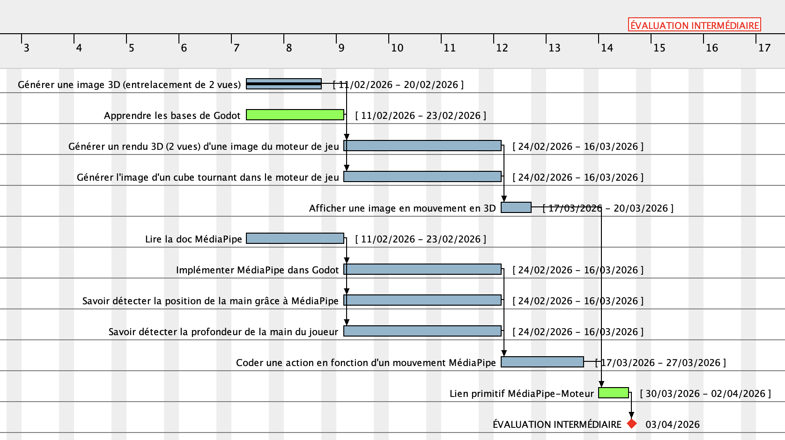
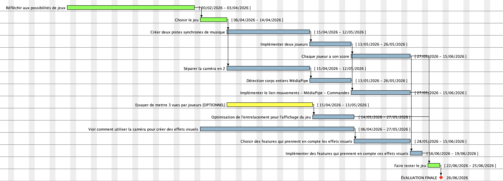
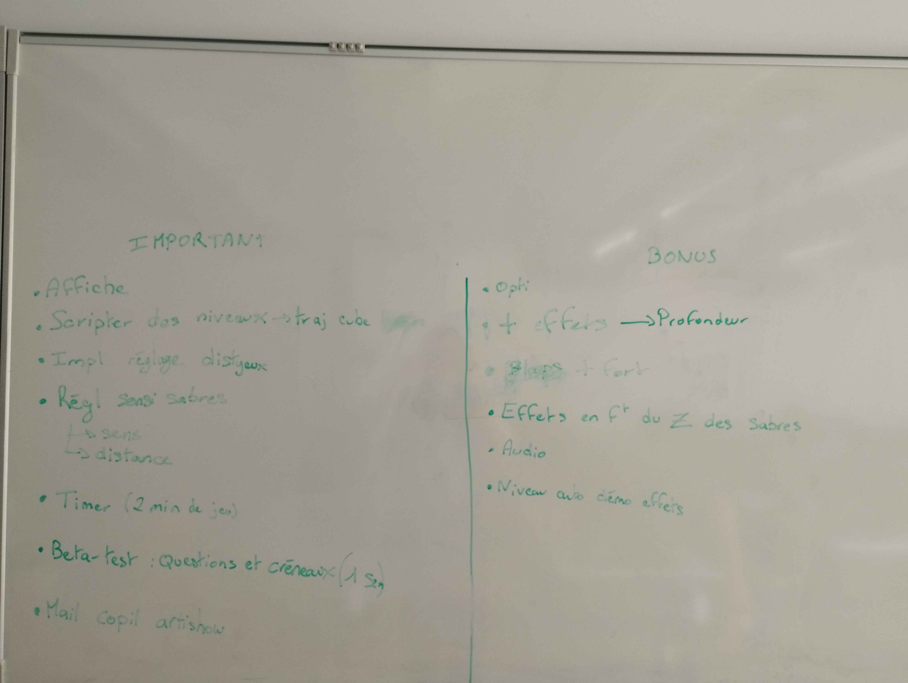

## Diagramme / Planning global
### Période 1 (Début -> Évaluation intermédiaire)

### Période 2 (Évaluation intermédiaire -> Évaluation finale)

Légende : 
- En vert : tâches de groupe
- En bleu : tâches attribuées à une partie du groupe
- En jaune : tâches optionnelles / d'importance mineure
- En rouge : jalons

## Répartition des tâches

- **V0**: premiers exemples pour tester et expérimenter, sans structure bien définie
- **V1**: code fonctionnel, structuré mais indépendant des autres tâches
- **V2**: code fonctionnel intégré à l'ensemble

| Tâche                         | Responsables  | V0 (prévu) | V0 (réalisé) | V1 (prévu) | V1 (réalisé) | V2 (prévu) | V2 (réalisé) |
| ----------------------------  | ------------- | ----       | ----         | ----       | ----         | ---        | ---          |
| Création du terrain de jeu (cube, mouvement, caméra)   | Van-Kévin     | 13/03      | .....        | .....      | .....        | .....      | .....        |
| Rendu des images              | Adam et Hélias              | .....      | .....        | .....      | .....        | .....      | .....        |
| Détection des mouvements      | Birame et Hugo       | 13/03      | .....        | .....      | .....        | .....      | .....        |

| Tâche (détaillée)             |Description |Responsables  |Date de début (effective) | Date de fin (effective) |
| ----------------------------  | ------------- | ----       | ----         | ----       |
| Générer une image 3D (entrelacement de 2 vues) | Écrire un programme Python pour entrelacer plusieurs vues et l'afficher | Van-Kévin | 11/02/26 | 11/02/26 |
|Apprendre les bases de Godot | Lire la doc, regarder des tutos pour se familiariser avec l'environnement de développement | Groupe | 11/02/26 | 23/02/26 |
|Générer un rendu 3D (2 vues) d'une image du moteur de jeu | Générer et afficher une image 3D depuis Godot | Adam, Hélias | 27/02 | 13/03 (merci VK) |
|Générer l'image d'un cube tournant dans le moteur de jeu | Créer une scène dans Godot avec un cube tournant | Van-Kévin | 19/02 | 20/02 |
|Afficher une image en mouvement en 3D | Génerer plusieurs images et les afficher pour rendre le mouvement sans stocker d'images intermédiaire dans l'espace mémoire | Adam, Hélias | 27/02 | 13/03 |
|Lire la doc MédiaPipe | ... | Hugo et Birame | 11/02 | 20/02 |
|Implémenter MédiaPipe dans Godot | ... | Hugo et Birame | 20/02 | 12/03 |
|Savoir détecter la position de la main grâce à MédiaPipe | ... | Hugo et Birame | 12/03 | 16/03 |
|Savoir détecter la profondeur de la main du joueur | ... | Hugo et Birame | 16/03 | 16/03 |
|Coder une action en fonction d'un mouvement MédiaPipe | ... | Hugo et Birame | 16/03 | 31/03 |
|Lien primitif MédiaPipe-Moteur | Afficher un cube tournant qui s'arrête de tourner quand l'utilisateur exécute un mouvement particulier (ouvrir ou lever la main) | Groupe | 30/03 | 10/04 | 
| Réfléchir aux possibilités de jeux| Noter dans un fichier toutes les idées de jeux, chercher en ligne des templates open-source (la piste des jeux VR est à explorer) | Groupe |  20/02 |  27/03 | 
|Choisir le jeu | ... | Groupe | 27/03 | 27/03 |
|Créer deux pistes synchrones de musique | Dédoubler la piste d'OpenSaber de sorte à pouvoir jouer au même niveau sur deux pistes en même temps | VK et Hélias | 10/04 | ... |
|Implémenter deux joueurs | Un joueur sur chaque piste pour jouer au jeu à 2 (dans le projet OpenSaber) | VK et Hélias | ... | ... |
|Chaque joueur à son score | Bien considérer les deux pistes comme deux jeux différents (même si même musique en même temps) | VK et Hélias | ... | ... |
|Séparer la caméra en 2 | ... | Birame et Hugo | 10/04 | ... |
|Détection corps entier MédiaPipe | ... | Birame et Hugo | ... | ... |
|Implémenter le lien mouvements - MédiaPipe - Commandes | ... | Birame et Hugo | ... | ... |
|Mettre 3 vues par joueurs [OPTIONNEL]| ... | Groupe | ... | ... |
|Optimisation de l'entrelacement pour l'affichage du jeu | ... | VK et Hélias | ... | ... |
|Voir comment utiliser la caméra pour créer des effets visuels | ... | Hélias | 27/03 | ... |
|Choisir des features qui prennent en compte les effets visuels | ... | ... | ... | ... |
|Implémenter des features qui prennent en compte ces effets visuels | ... | ... | ... | ... |
|Faire tester le jeu | Phase cyclique de tests, corrections, tests, corrections... | Groupe | ... | ... |
|Afficher les performances | Temps de génération avec/sans entrelacement, nombre de trames de la caméra/MédiaPipe... | Groupe | 16/03 | ... |

## Actualisation
Des changements de direction et des avancées rapides ont vite rendu le planning obsolète.
À la date du 10 juin 2026, voici les tâches à accomplir identifiée après une période de brainstorming :

| Tâche                         | Description | Responsables  | État | Priorité |
| ----------------------------  | ------------- | ----       | ----         | ----       | 
| Faire l'affiche                         | cf [semaine finale](https://gitlab.telecom-paris.fr/proj104/2025-2026/artishow/-/blob/main/SEMAINE_FINALE.md?ref_type=heads#poster) | Hugo Belle  | En cours | Urgent |
| Scripter des niveaux                        | Créer des niveaux jouables (musique, timing, trajectoire et nombre de cubes, type de cubes etc.) | VK, Hélias  | En cours | Urgent |
| Implémenter une phase de calibrage                         | Calibrer : la distance maximale des sabres, sensibilité des sabres, l'orientation et la distance des caméra pour un effet 3D correct, éventuellement placement des joueurs avec caméra active pendant la phase de calibrage | Tous  | Pas commencé | Urgent |
| Implémenter un timer                         | Limiter les phases de jeu à 2 min et mettre un petit affichage de qui a gagné + les high scores | VK  | Pas commencé | Urgent |
| Préparer des questions pour les beta-testeurs                         | Faire un google form pour récolter des avis constructifs pour améliorer le jeu | Hélias  | Pas commencé | Urgent |
| Trouver une place pour la journée artishow                         | Envoyer un mail pour demander une place adéquate au projet | Hélias  | Fait | Urgent |
| Optimiser les performances du jeu                         | ..... | Tous  | En cours | Faible |
| Rajouter des effets                         | Notamment de profondeur | Hélias  | En cours | Faible |
| Améliorer le bloops                         | Les tâches d'encre ne sont pas suffisament handicapante, régler ce problème | VK  | Pas commencé | Faible |
| Effet profondeur sabres                        | Ajouter des effets sur la collision/la trajectoire des cubes selon la profondeur (z) avec laquelle ils sont touchés | Birame  | Pas commencé | Faible |
| Ajouter des effets audios et de la musique                         | ..... | Tous  | En cours | Faible |
| Niveau de démonstration des effets                         | Implémenter un niveau (possiblement une vidéo / un niveau auto) pendant lequel tous les effets se jouent, même ceux qu'on aurait finalement pas gardés | Tous  | Pas commencé | Faible |
| Optimiser l'utilisation des sabres                         | Faire en sorte qu'ils ne tournent pas trop sans qu'on le veuille, que le lien bras-sabre semble vraiment bien fluide | Birame  | Pas commencé | Faible |

## Compte-rendu des séances

### Séance 1 - 11/02

**Objectifs pour la séance 2 :**

> Regarder des tutoriels pour comprendre Godot

> Planning et répartition des tâches

***Pour l'évaluation intermédiaire :*** 

Il faudrait avoir une démo qui teste déjà MediaPipe, la corrélation, le stéréo et le jeu (ex : Un jeu où on a un cube qui tourne si on baisse la main et qui tourne si on le lève). L'idée est d'avoir une base solide qu'on peut réutiliser pour la suite (c'est censé représenter un tiers de la charge de travail totale). Ce n'est pas grave de ne pas avoir de jeu final (on peut toujours avoir une petite liste de candidats). Il faut s'assurer que chaque bloc est opérationnel.

**Proposition de test pour l'évaluation intermédiaire :** Réaliser un jeu minimaliste dans lequel on contrôle la rotation d'un cube. Lever la main stopperait le cube et la baisser le ferait tourner.

***Remarques de J. Lefeuvre :***
- Faire le versionning dans Git (pas de copie V2, V3, V4, etc...)
- Pour les fihiers tests, les mettre dans un dossier `src` et les documenter de telle sorte que les autres puissent les utiliser.

### Séance 2 - 20/02

Objectifs pour la prochaine séance :

> Commencer le brainstorming sur les jeux (idées potentielles, critères de gameplay, etc...)

***Remarques de J. lefeuvre sur le planning :***
- Rajouter des descriptions aux tâches
- Remplir le tableau des tâches au fur et à mesure pour suivre la progression
- Rajouter une tâche "Brainstorm d'idées de jeux" (quitte à ne pas les conserver après) qui durerait de maintenant à l'évaluation intermédiaire
- Rajouter une tâche de groupe de documentation
- Distinguer la phase d'implémentation du gameplay de l'implémentation d'effets autostéréoscopiques
- Rajouter une phase de *gamification* dans le jeu. Il faudrait que tout le monde puisse tester le jeu -> Jeu court. Il faut par ailleurs prévoir un cycle dev, test user, correction
- La répartition des tâches s'interrompt à l'évaluation intermédiaire. Il faudra l'adapter entre l'évaluation intermédiaire et l'évaluation finale. Il y aura du boulot pour tout lemonde (ex : Séparer MediaPipe en 2 tâches : une partie utilisation de gestes simples et évaluation de le précision et une partie sur la gestion de la profondeur. Séparer le rendu en 2 tâches : Gestion des objets et gestion des effets visuels, etc...)

***Autres remarques :***
- Modifier le `README.md` pour rendre le dépôt plus lisible

### Séance 3 - 23/02 (Encadrant absent)

### Séance 4 - 13/03

### Séance 5 - 16/03

***Remarques de J. Lefeuvre :***
- Rappel : Evaluation entre pairs en mi-mai
- Rendu : Il faut synchroniser la fréquence de rendu avec la fréquence de raffraîchissement de l'écran. Dans le GPU, il faudrait 2 buffers de générations d'image : un pour "vraiment" afficher le jeu, un autre pour calculer le rendu de la frame suivante. Pour ensuite l'afficher, il faut privilégier des swaps entre pointeurs plutôt que des copies (plus long). 
- MediaPipe : Déterminer le temps de rendu (=temps pris pour capturer une image et donner les informations dessus). Cette information sert pour adapter la fréquence de rendu. De plus, il faut également regarder :
  - si le traitement MediaPipe (task) s'effectue en parallèle (pas de boucle for)
  - comment sont gérés les images en mémoire

### Séance 6 - 27/03

***Remarques de J. Lefeuvre :***
- **Urgent** : Profondeur/Distance Caméra (Distance max actuel = 2,80m)
- Regarder la fréquence de raffraîchissement des données traitées par MediaPipe et la comparer avec celle de la caméra
- Regarder les différentes performances selon les PC
- Regarder MediaPipe + pieds
- Regarder les effets de profondeur possibles : inversion de stéréo / des vues -> Effet soit sur le jeu entier soit sur un objet qui dénote du reste. **Il faut être capable montrer plus qu'un simple jeu (perfs, technologies, ...)**
- *Skinning* : Model 3D pour les main = T-pose + mèches = On attribue des poids à chaque partie du squelette (triangles). Regarder dans Godot l'animation de squelette et en faire un projet à part (pour une démonstration) => **Il faut couvrir tous les outils techniques qu'on pourrait utiliser**

Objectifs pour la prochaine séance :
> Régler les problèmes de détection de la caméra liés à la profondeur

> Identifier un projet proposant un avatar 3D et le contrôler avec la caméra

> Etudier les possibilités d'implémentations d'effets stéréo

> Déterminer la fréquence de raffraîchissemnt des données MediaPipe 

### Séance 7 - 03/04

### Séance 8 - 10/04

***Remarques de J. Lefeuvre :*** 
- Implémenter le tracking de 2 corps complets (en splitant la caméra) pour la prochaine séance
- Faire des tests d'effets stéréo (pas forcément implémenté dans le jeu)
- Rajouet une section *How to* dans le `README.md`

### Séance 9 - 15/04

### Séance 10 - 21/04

**Evaluation intermédiaire : *Remarques de J. Lefeuvre :***

*Partie jeu (présenté lors de la séance) :*

- Rajouter une touche pour régler l'interoculaire directement dans le jeu
- Retirer la caméra de l'affichage (ou faire un truc plus discret, par exemple mettre une touche pour activer/désactiver le display)
- Régler la focale des caméras du jeu / la profondeur perçue en jeu
- **Pour l'évaluation finale** : Prévoir des roulements de staff sur nos stands : Tout le monde doit être capable de pouvoir vendre le projet (même sans rentrer dans les trop grandes lignes si on est pas le spécialiste) -> fiche de stand
- **Remplaçer les vues noires par des vues avec un fond commun du jeu** (ex : on dit que les joueurs se font face, que derrière eux c'est l'infini/fond commu, et que pour chacun des joueurs, ils sont à 0).
- Bon temps d'entrelaçement (= pas pénalisant). **Ajouter le temps de détection aux temps du CPU**.

*Partie profondeur :*
- **URGENT : Rajouter un mode *freeze*** dans le jeu pour pouvoir évaluer la qualités des effets stéréo
- Effets dispos : Inversions des yeux (et inversion des joueurs)

*Partie idée de jeux :*
- Partir d'un projet existant ne pose pas de problème, il faut juste comprendre les limites imposées par le projet existant (ex : Les années précédentes, dans le projet `MarioKart`, l'infini occuliare était l'infini imposé par le jeu).
- Si jamais on veut faire un fork, il faut bien étudier le jeu pour savoir quoi ajouter où
- Regarder si on peut intepréter les gestes d'attaque sur le cube (notamment la partie profondeur)
- FPS / TPS ? On passe d'un jeu mono-joueur à deux joueurs : à voir si c'est trop compliqué ?
- **Définir précisément le gameplay (actions possibles, interactions, etc..). Ex : renvoyer un cube si on tape avec deux bâtons** et regarder si c'est jouable (niveau temps de développement). Les effets seront plus durs à implémenter sur un projet déjà existant (on subit les contraintes et ça peut être frustrant). 
- **Refaire le jeu depuis le début est tout à fait envisageable**. Seul la partie synchronisation avec le rythme coince pourf l'instant. *Idée proposée :* utiliser des analyseurs de BPM / détecteurs d'attaques pour adapter la génération aléatoire du jeu selon le rythme de la musique (on pourrait récupérer un JSON à fournir au jeu).
- *Rappel :* Il faut une beta la semaine du 20 juin. Préparer les questions à poser aux beta-testeurs pour que les retours nous soient le plus utiles possible (et le documenter dans un fichier à part).

A faire pour la prochaine fois :

> Poser les animations (mode freeze)

> Changer les paramètres de caméra virtuelle (interocculaire, profondeur perçue)

> Regarder les effets sur les objets

> Etudier le projet sur lequel on veut partir pour savoir si c'est vraiment envisageable (ex : essayer de faire une génération stéréo du jeu) 

> **Faire un descriptif détaillé du jeu** (se décider sur le gameplay et si on part du projet existant)

### Séance 11 - 05/05

### Séance 12 - 13/05

### Séance 13 - 27/05

### Séance 14 - 10/06

***Remarques de J.Lefeuvre :***
- Prévoir un planning de questions à poser à des beta-testeurs
- Pour l'affiche : mettre les perfs (entrelacement selon les machines, ...), laisser du vide pour parler des tests utilisateurs, parler de l'organisation du gameplay (sfx, vfx) => diagramme d'architecture, présentations des effets "originaux" (même ceux qui ne sont pas finalement dans le jeu, ne pas hésiter à les mettre dans une version beta)
- Prévoir un mode "automatique" : le jeu tourne en boucle tout seul et présente tous les effets qu'on envisage dans le gameplay
- Envoyer un mail au copil Artishow pour lui demander de se mettre devant un mur avec 4-5 mètres de profondeur

### Séance 15 - 15/06 

### Séance 16-20 - Semaine du 22/06